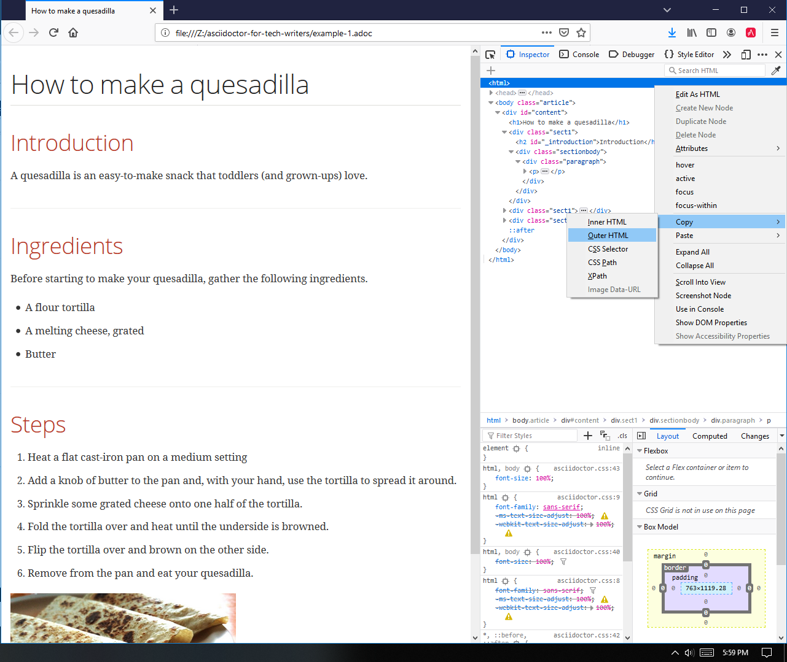

= project-notes
:toc:

== Purpose
This is the file in which I will track my project tasks

== Outline

* Introduction to this guide
** Coupled with an advanced text editor, AsciiDoc is my all-time favorite writing tool
** I have used it every day in my work for four years
** I have used it to write large document sets for several companies
** While in its most basic form, it is quite simple to use, it is not so straightforward to use it at a professional writing tool without a good grounding in programming/IT world.
** While AsciiDoc has become well-used in the IT world for documenting software systems, code, and so on, it is only just being discovered by mainstream tech writers working in other industries.
* Who this guide is for
** This guide will help tech writers to get started with one of the best writing tools yet created
** Tech writers and those wishing to enter the tech writing field who want to learn how to implement an up-and-coming, powerful lightweight markup language.
* What do you need to know before starting with this guide?
** While this guide will cover some quite technical ideas, you do not need to be a computer programmer or in other ways software savvy to use it.
** Everything you need is explained from the ground up
* Why should tech writers know how to write with AsciiDoc?
* How this guide is organized

* A brief introduction to AsciiDoc
** What is AsciiDoc
** http://asciidoc.org/ flavor and asciidoctor flavor
** Some of the best features of AsciiDoc
** How writing with AsciiDoc is different from other writing tools

* Writing a simple document in the simplest way
** Use https://asciidoclive.com[] or http://espadrine.github.io/AsciiDocBox/[] for a live demo maybe
** Recreate an article from Wikipedia in a simple text editor
*** Download preview extension for Chrome or Firefox.
*** Need to set the requirement in Chrome "Allow access to file urls"
*** Open Notepad in Windows or EditPad in Apple
*** Narrated screen video showing how to start a document with just a heading1 and open it in live preview.
*** Re-create example-1.adoc
** What can you do with this?
*** Copy the entire text from the browser and paste it into an email. Nicely formatted. Can adjust the formatting.

To get the html out of AsciiDoctor.js Preview extension:

In Firefox:

. Right-click in the rendered preview > Inspect Element.
. In the Inspector panel, right-click the HTML node > Copy > Outer HTML.
. Open a text-editor file and paste in the clipboard text.

