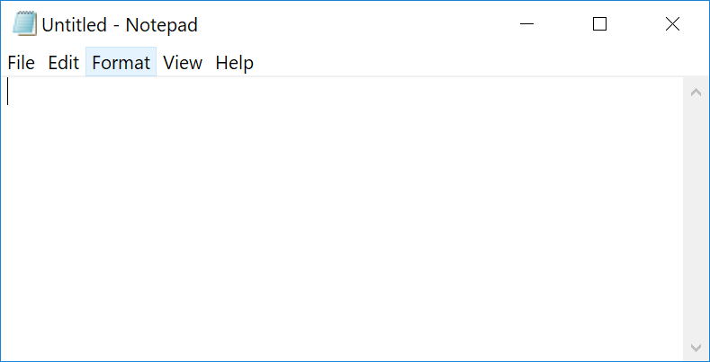

= Writing a simple document

We'll start by writing a simple document using the easiest method for creating an AsciiDoc file directly on your computer.

== What you'll need
To follow along you'll need a basic text editor and a browser with an installed extension for viewing the nicely formatted result.

=== The text editor
You can use any text editor, but the example screenshots use the default editor -- Windows Notepad.

Windows Notepad used to be a bad option because it didn't handle cross-platform line endings, but that is now fixed.

If you work on a Mac TextEdit would be the equivalent.

=== The browser extension
To show what the HTML created from the AsciiDoc document looks like as you write, you can use the Chrome or Firefox browser with an installed extension called Asciidoctor.js Live Preview.
Actually Opera also supports the AsciiDoctor extension, but I'm just giving instructions for the big two.

*To install the extension for Chrome:*

. Open Chrome and in the navigation bar type `chrome://extensions/` to open the Extensions page.
. Click the settings menu
+
image::images/chrome-extension-1.png[]

. Need to set the requirement in Chrome "Allow access to file urls"

== Writing the document
I'm going to create a document for a simple recipe, but you can of course substitute with your own text.

=== The first few paragraphs

. Open your text editor.
. On the very top line, type:
+
image::images/quesadilla-1.png[]
+
This is the document title, also known as the first-level heading, level-one heading, or h1 heading (in HTML speak).

. Leave a blank row underneath and type a level 2 heading followed by a paragraph:
+
image::images/quesadilla-2.png[]

You can see already is that the heading level is denoted by the number of equal signs.
For the heading to be recognized, the leftmost equal sign must be against the left edge of the document and there must be a space before the heading text.

The h1 heading is the only one that needs a blank line underneath.
That's because the line underneath is reserved for optional document attributes, which we'll cover later.

The second-level heading with the two equal signs has a line of text immediately below it.

If you have heading levels out of order, say a heading 3 without a heading 2 above it, you can still create an output, but AsciiDoc processors will warn you that you have the structure out of sequence.
This is a great thing because it doesn't hold up your work, but still helps you write your document with a logically correct structure.

There is another way to denote the first couple of heading levels, but for now we'll just use the equal signs.

Text written without any markup is a simple text paragraph.

Let's continue with the document.

=== Viewing the result in a browser

=== Adding lists

Start a new paragraph by

== What can you do with this?

=== Copy the entire text from the browser and paste it into an email. Nicely formatted. Can adjust the formatting.

Narrated screen video showing how to start a document with just a heading1 and open it in live preview.

////

* Writing a simple document in the simplest way
** Use https://asciidoclive.com[] or http://espadrine.github.io/AsciiDocBox/[] for a live demo maybe
** Recreate an article from Wikipedia in a simple text editor

////
