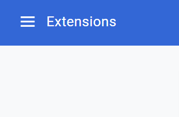
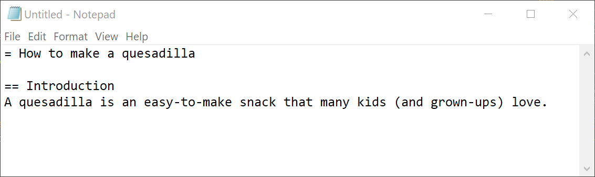
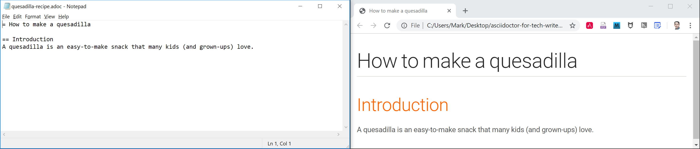
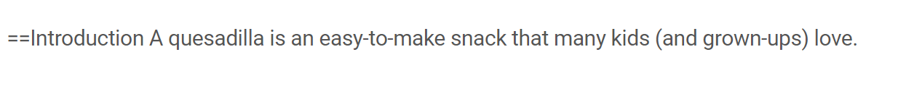

= Writing a simple document
:toc:
:toclevels: 4

This article shows you how to use AsciiDoc to write a simple document in a text editor and view it as HTML.

== The tools

=== The text editor
You can use any text editor to write a document in AsciiDoc, but to keep things simple we'll use your operating system's default editor.
On a Mac this is TextEdit and on Windows it is Notepad.
Windows Notepad link:#aside[is not the best option] for writing documents in general, but it's fine for this example and you'll see it used in the screenshots below.

// image::images/windows-notepad.png[width=50%]

=== The browser
To write a document in AsciiDoc you only need a text editor.
However, it does help as you write to see what the document looks like as nicely styled HTML.
To view the HTML we'll use either the Chrome, Firefox, or Opera browser, which all support a extension called *Asciidoctor.js Live Preview*.

[.procedure-intro]
To install the extension for Chrome:

. Open Chrome and in the navigation bar type `chrome://extensions/` to open the Extensions page.
. Click the settings menu
+

. Need to set the requirement in Chrome "Allow access to file urls"

Note the icon in the toolbar.
Clicking the icon toggles the extension on and off.

[.procedure-intro]
To install the extension for Firefox:

. One
. Two

Note the icon in the toolbar.
Clicking the icon toggles the extension on and off.

== Writing the document
This first example is for a recipe, but you can of course follow the general idea while writing about whatever subject interests you.

=== The first few lines
. Open your text editor and type the following:
+
image::images/quesadilla-1.png[]
+
You just typed the document title, which becomes the h1 heading when converted to HTML.

. Leave a blank line then type a sub-heading and a paragraph following the example in the screenshot below.
+

. Save the file, giving it a name and the extension `.adoc`, such as `quesadilla-recipe.adoc`.
+
You can also use the extension `.asciidoc`, but why type more characters.

. Open your browser.
. Open the AsciiDoc file in the browser by dragging the file into the browser window.

You should now be able to see your recipe document rendered as HTML in the browser.

=== Debrief
There's a lot to learn from this brief example.

==== What you've learned
* Marking up the start of a line with one or more equals signs denotes a heading.
* The number of equals signs denotes the heading level when converted to HTML:
+
....
= becomes <h1>
== becomes <h2>
=== becomes <h3>, and so on
....

* A paragraph of plain text without any markup makes a paragraph.

==== Some syntax rules
There are a couple of syntax rules that are important to know when writing headings.

* The leftmost equals sign for a heading must lie against the left edge of the document or you'll get an indented block instead like this:
+
image::images/quesadilla-syntax-1.png[]

* There must be at least one space in front of the title text to avoid the equals signs being treated as literal characters like this:
+

+
Using only one space between the equals sign and text is preferred because text editors using syntax highlighting may otherwise not highlight the heading.
More about that later.

==== Additional detail
The document title is actually optional, so you could begin the document with a text paragraph.
You might do this, for example, when creating a document fragment that you'll later merge with another document fragment.

If you remember, we needed to leave a blank line immediately below the document title.
This is because AsciiDoc documents comprise a document header followed by a document body.
The document header contains the document title followed by optional document attributes.
The document body contains a series of sections, each of which starts with a title.

// image of a document with a header, blank line, and body

A blank line is needed to tell software processors where the header ends and the body starts.
We'll cover this in more detail later.

There is another way to denote the heading levels, but using the equal signs is the preferred method.

Let's continue with the document.

=== Adding lists

Start a new paragraph by

=== Debrief

==== What you've learned

==== Some syntax rules

==== Additional detail

[#aside]
== Aside
Windows Notepad is generally a poor choice for writing text documents because except for the latest version that most people don't have, its files are incompatible with other operating systems.
However, it works well for our purposes here.

The AsciiDoc specification names the headings as follows:

----
= Document Title (level 0) (h1)
== Section title (level 1) (h2)
=== Section title (level 2)
==== Section title (level 3)
----

However, somewhat confusingly, these correspond to

== What can you do with this?

=== Copy the entire text from the browser and paste it into an email. Nicely formatted. Can adjust the formatting.

Narrated screen video showing how to start a document with just a heading1 and open it in live preview.

////

* Writing a simple document in the simplest way
** Use https://asciidoclive.com[] or http://espadrine.github.io/AsciiDocBox/[] for a live demo maybe
** Recreate an article from Wikipedia in a simple text editor

////
