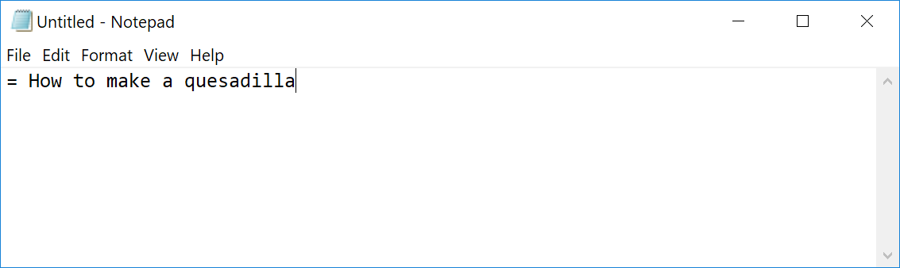

= Writing a simple document
We'll start by writing a simple document.

== What you'll need
For this example you'll need:

* A basic text editor
* Either the Chrome, Firefox, or Opera browser

=== The text editor
You can write AsciiDoc using any text editor.
On a Mac you can use TextEdit, the default text editor.
On Windows, the equivalent is Windows Notepad.

Windows Notepad link:#aside[is not the best option] for writing documents in general, but it's fine for this example and you'll see it used in the screenshots below.

=== The browser
To write a document in AsciiDoc you only need a text editor.
However, when you're starting out it helps to get immediate feedback about what the document looks like as HTML.

For this we'll use either the Chrome or Firefox browser with an installed extension called *Asciidoctor.js Live Preview*.
Actually, Opera also supports this extension, but I'm just giving instructions for the big two.

[.procedure-intro]
To install the extension for Chrome:

. Open Chrome and in the navigation bar type `chrome://extensions/` to open the Extensions page.
. Click the settings menu
+
image::images/chrome-extension-1.png[]

. Need to set the requirement in Chrome "Allow access to file urls"

Note the icon in the toolbar.
Clicking the icon toggles the extension on and off.

[.procedure-intro]
To install the extension for Firefox:

. One
. Two

Note the icon in the toolbar.
Clicking the icon toggles the extension on and off.

== Writing the document
This first example shows how to write a document containing a recipe, but you can of course follow the general idea while writing about whatever subject interests you.

=== The first few lines
. Open your text editor and type the following:
+

+
This line forms the document title.

. Following the example in the screenshot below, leave a blank line then type a sub-heading and a paragraph.
+

. Save the file, with a name and an extension of `.adoc` such as `quesadilla-recipe.adoc`.
+
You can also use the extension `.asciidoc`, but as it's more characters to type there's little point.

. Open your browser with the *Asciidoctor.js Live Preview* extension.
. Open the AsciiDoc file in the browser by either:
* Dragging the file into the browser window.
* Right-clicking the file and using an open command.
* Showing the browser top level menu and using File > Open.

You should now be able to see your recipe document rendered as HTML in the browser.

=== Debrief
There's a lot to learn from just this brief example.
You can see that:

* Marking up the start of a line with one or more equals signs denotes a heading
* The number of equals signs denotes the heading level
* Plain text without any markup makes a paragraph.

=== Some rules
With a little experimentation we can discover some syntax rules that are important to know.

==== The leftmost equal sign must lie against the left edge of the document.

* There must be at least one space after the rightmost equals sign and before the heading text.
+
It's a good idea to only use one space before the text because some text editors that use syntax  highlighting won't highlight the heading if there is more than one space.
More about that later.

The h1 heading is actually optional.
You could start the document with a text paragraph.
This is the only heading that needs a blank line below it.
That's because lines immediately underneath the h1 heading are reserved for optional document attributes, which we'll cover later.
A blank line is needed to let processors know when the body of the document starts.

The second-level heading with the two equal signs has a line of text immediately below it.

If you have heading levels out of order, say a heading 3 without a heading 2 above it, you can still create an output, but AsciiDoc processors will warn you that you have the structure out of sequence.
This is a great thing because it doesn't hold up your work, but still helps you write your document with a logically correct structure.

There is another way to denote the first couple of heading levels, but for now we'll just use the equal signs.

Text written without any markup is a simple text paragraph.

* The h1 heading must have a blank line underneath. rewrite to the body must have a blank line above - this is clearer.
*
Let's continue with the document.

=== Viewing the result in a browser

=== Adding lists

Start a new paragraph by

[#aside]
== Aside
Windows Notepad is generally a poor choice for writing text documents because except for the latest version that most people don't have, its files are incompatible with other operating systems.
However, it works well for our purposes here.

The AsciiDoc specification names the headings as follows:

----
= Document Title (level 0) (h1)
== Section title (level 1) (h2)
=== Section title (level 2)
==== Section title (level 3)
----

However, somewhat confusingly, these correspond to

== What can you do with this?

=== Copy the entire text from the browser and paste it into an email. Nicely formatted. Can adjust the formatting.

Narrated screen video showing how to start a document with just a heading1 and open it in live preview.

////

* Writing a simple document in the simplest way
** Use https://asciidoclive.com[] or http://espadrine.github.io/AsciiDocBox/[] for a live demo maybe
** Recreate an article from Wikipedia in a simple text editor

////
